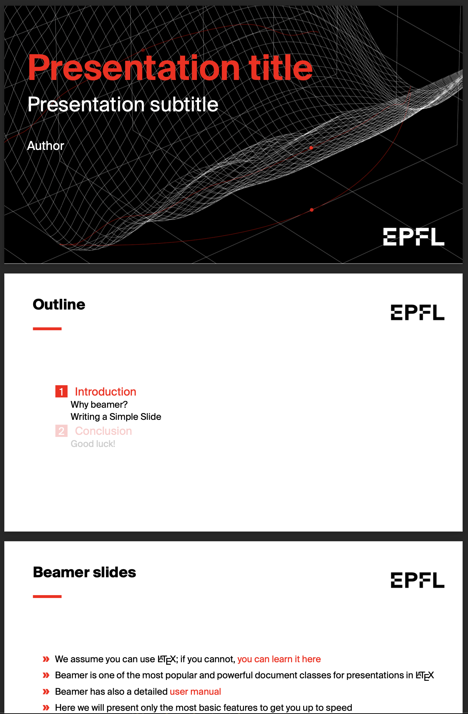

# EPFL Beamer tempate slides

A simple beamer class for *EPFL*. 

Written by:
Titouan Renard, titouan.renard@gmail.com

Inspired by the template for LUT by Aleksei Mashlakov,
itself inspired by the template for SINTEF by Federico Zenith,
which was derived (through several iterations) from Håvard Berland's
beamerthementnu class.

This program is free software: you can redistribute it and/or modify
it under the terms of the GNU General Public License as published by
the Free Software Foundation, either version 3 of the License, or
(at your option) any later version.

This program is distributed in the hope that it will be useful,
but WITHOUT ANY WARRANTY; without even the implied warranty of
MERCHANTABILITY or FITNESS FOR A PARTICULAR PURPOSE.  See the
GNU General Public License for more details.

You should have received a copy of the GNU General Public License
along with this program.  If not, see <http://www.gnu.org/licenses/>.